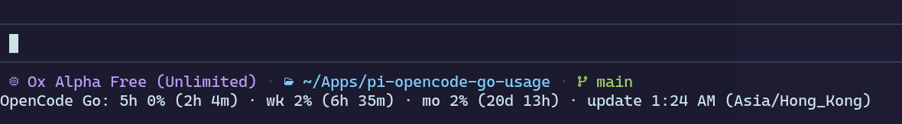

# pi-opencode-go-usage

在会话中实时追踪 OpenCode Go 的用量限额 —— **滚动 5 小时、每周、每月**，
通过实时状态栏和 `/opencode-go` 报告组件展示。



```
状态栏：  Go 5h 62% · wk 31% · mo 44%

报告组件：
  OpenCode Go Usage
  Workspace: wrk_xxxxxxxxxxxxxxxxxxxxxxxx
  Rolling 5h ██████░░░░  62% · 1h 12m
  Weekly     ███░░░░░░░  31% · 3d 4h
  Monthly    ████░░░░░░  44% · 12d 0h
  Updated 2:32:05 PM  （时间格式随你的区域设置而定）
```

## 为什么需要它

`/console/<wrk_…>/go` 页面是客户端应用，交付的 HTML 里没有数值，
数据来自控制台 JSON API：

```
GET https://opencode.ai/console/api/go/status     (x-org-id: wrk_…)
-> { access: { meters: {
      fiveHour: { resetsAt, limitMicroCents, usedMicroCents },
      week:     { resetsAt, limitMicroCents, usedMicroCents },
      month:    { limitMicroCents, usedMicroCents } } } }
```

本扩展用你的浏览器会话 cookie 调用该接口，推导出三个百分比（`已用 / 限额`；
金额字段单位为微分，即 1e-8 美元）与重置倒计时。
它**只报告百分比和倒计时** —— 不占用界面展示金额。

## 安装

```bash
omp plugin install github:dakai/pi-opencode-go-usage
# 或用于本地开发：
omp plugin link /path/to/pi-opencode-go-usage
```

然后重启会话（或 `/reload`）。

## 连接

你需要从已登录的 opencode.ai 账号获取两样东西：

1. **工作区 ID（Workspace ID）** —— 地址栏中的 `wrk_…` 片段：
   `opencode.ai/console/`**`wrk_…`**`/go`
2. **会话 cookie** —— 在该页面按 F12 → Application → Cookies →
   `https://opencode.ai` → `__Host-console_session` 行 → 复制其 Value
   （它是 `HttpOnly`，`document.cookie` 取不到）。

可以设置环境变量（推荐 —— 可避免 cookie 出现在会话历史中）：

```bash
export OPENCODE_GO_WORKSPACE_ID=wrk_…
export OPENCODE_GO_AUTH_COOKIE='…'
```

或使用斜杠命令（持久化到 `~/.omp/agent/opencode-go-usage.json`，权限 0600）：

```
/opencode-go --connect wrk_… <会话-cookie-值>
```

只给值时会按 `__Host-console_session=<值>` 发送。若要指定其他 cookie 名，
或一次发送多个，可直接传入完整的 cookie 对：`name=value; name2=value2`。

环境变量**优先于**保存的文件：只要它们已设置，`--connect` / `--cookie` 会保存但不生效
（命令检测到这种情况时会给出警告）。请取消设置，或导出新的值。
`OPENCODE_GO_CONFIG_PATH` 可覆盖配置文件位置（默认 `~/.omp/agent/opencode-go-usage.json`）。

## 命令

| 命令                                    | 作用                                                        |
| --------------------------------------- | ------------------------------------------------------------- |
| `/opencode-go`                          | 抓取并显示报告组件                              |
| `/opencode-go --connect <wrk> <cookie>` | 保存两者，抓取，显示                                        |
| `/opencode-go --workspace <id>`         | 仅保存工作区 ID                                        |
| `/opencode-go --cookie <value>`         | 仅保存 cookie                                              |
| `/opencode-go --disconnect`             | 清除两者                                                   |
| `/opencode-go --refresh`                | 立即重新抓取                                               |
| `/opencode-go --compact [on\|off]`      | 切换精简状态栏（`Go: 5h 0% · wk 2% · mo 2%`）               |
| `/opencode-go --json`                   | 导出报告到 `~/.omp/agent/opencode-go-usage-report.json` |

用量每 5 分钟自动刷新一次。

## 失败模式

| 状态文本                                | 含义                    | 修复                           |
| ------------------------------------- | -------------------------- | ----------------------------- |
| `Session expired`                     | 控制台会话已过期  | 用新 cookie 重新连接 |
| `No Go subscription on this workspace`| 该工作区没有 Go 订阅 | 检查工作区 |
| `Console API response unrecognised`   | 控制台接口结构已变更 | 更新解析器             |
| `Network error` / `Request timed out` | 瞬时错误                  | 重试                         |

## 安全性

这是对你本人用量数据的认证读取，cookie 存储在 `0600` 权限文件中（或环境变量）。
它只报告控制台已经展示的信息；接口变更会导致其失效，届时它会明确报错，
而不是自信地显示一个零值。

## 许可证

MIT
